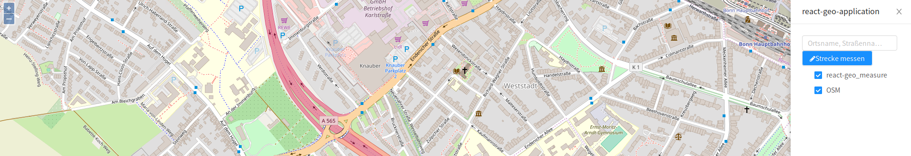

# LayerTree

* Tree component displaying the map layers in a hierarchical way

* [Documentation](https://terrestris.github.io/react-geo/docs/latest/index.html#!/LayerTree)


Autoconfigured with the topmost layer group ([OpenLayers LayerGroup](https://openlayers.org/en/latest/examples/layer-group.html)) of passed map.

[](../screenshots/layer_tree.png)
**Task:** Add a basic LayerTree to the drawer.

**Hint:** To display the OSM Layer properly, add the `name` property to the `layer` variable.

```javascript
<LayerTree
  map={map}
/>
```

The layer group ([OpenLayers LayerGroup](https://openlayers.org/en/latest/examples/layer-group.html)) can be passed as a prop as well.

[](../screenshots/layer_tree_group.png)

**Task:** Add the layers _Food insecurity layer_ and _World borders layer_ as a layer group to the LayerTree.

**Steps:**
1. Create the layer group for the two layers
  - Food insecurity layer `'https://api.tiles.mapbox.com/v3/mapbox.20110804-hoa-foodinsecurity-3month.json?secure'`
  - World borders layer `'https://api.tiles.mapbox.com/v3/mapbox.world-borders-light.json?secure'`
2. Add the layer group to the layers of the map
3. Extend the LayerTree component with the property `layerGroup`

```javascript
const layerGroup = new OlLayerGroup({
  name: 'Layergroup',
  layers: [
    new OlLayerTile({
      name: 'Food insecurity layer',
      minResolution: 200,
      maxResolution: 2000,
      source: new OlSourceTileJson({
        url: 'https://api.tiles.mapbox.com/v3/mapbox.20110804-hoa-foodinsecurity-3month.json?secure',
        crossOrigin: 'anonymous'
      })
    }),
    new OlLayerTile({
      name: 'World borders layer',
      minResolution: 2000,
      maxResolution: 20000,
      source: new OlSourceTileJson({
        url: 'https://api.tiles.mapbox.com/v3/mapbox.world-borders-light.json?secure',
        crossOrigin: 'anonymous'
      })
    })
  ]
});
```
```javascript
<LayerTree
  layerGroup={layerGroup}
  map={map}
/>
```

**Complete Example:**
```javascript
import React, { Component } from 'react';

import './App.css';
import 'ol/ol.css';
import 'antd/dist/antd.css';
import './react-geo.css';

import OlMap from 'ol/Map';
import OlView from 'ol/View';
import OlLayerTile from 'ol/layer/Tile';
import OlSourceOsm from 'ol/source/OSM';
import OlSourceTileJson from 'ol/source/TileJSON';
import OlLayerGroup from 'ol/layer/Group';

import { Drawer } from 'antd';
import {
  SimpleButton,
  MapComponent,
  NominatimSearch,
  MeasureButton,
  LayerTree
} from '@terrestris/react-geo';

const layer = new OlLayerTile({
  source: new OlSourceOsm(),
  name: 'OSM'
});

const layerGroup = new OlLayerGroup({
  name: 'Layergroup',
  layers: [
    new OlLayerTile({
      name: 'Food insecurity layer',
      minResolution: 200,
      maxResolution: 2000,
      source: new OlSourceTileJson({
        url: 'https://api.tiles.mapbox.com/v3/mapbox.20110804-hoa-foodinsecurity-3month.json?secure',
        crossOrigin: 'anonymous'
      })
    }),
    new OlLayerTile({
      name: 'World borders layer',
      minResolution: 2000,
      maxResolution: 20000,
      source: new OlSourceTileJson({
        url: 'https://api.tiles.mapbox.com/v3/mapbox.world-borders-light.json?secure',
        crossOrigin: 'anonymous'
      })
    })
  ]
});

const center = [ 788453.4890155146, 6573085.729161344 ];

const map = new OlMap({
  view: new OlView({
    center: center,
    zoom: 16,
  }),
  layers: [layer, layerGroup]
});

map.on('postcompose', map.updateSize);

class App extends Component {
  state = {visible: false};

  toggleDrawer = () => {
    this.setState({visible: !this.state.visible});
  }

  render() {
    return (
      <div className="App">
        <MapComponent
          map={map}
        />
        <SimpleButton
          style={{position: 'fixed', top: '30px', right: '30px'}}
          onClick={this.toggleDrawer}
          icon="bars"
        />
        <Drawer
          title="react-geo-application"
          placement="right"
          onClose={this.toggleDrawer}
          visible={this.state.visible}
          mask={false}
        >
          <NominatimSearch
            key="search"
            map={map}
          />
          <MeasureButton
            key="measureButton"
            name="line"
            map={map}
            measureType="line"
            icon="pencil"
          >
            Strecke messen
          </MeasureButton>
          <LayerTree
            map={map}
            layerGroup={layerGroup}
          />
        </Drawer>
      </div>
    );
  }
}

export default App;

```
