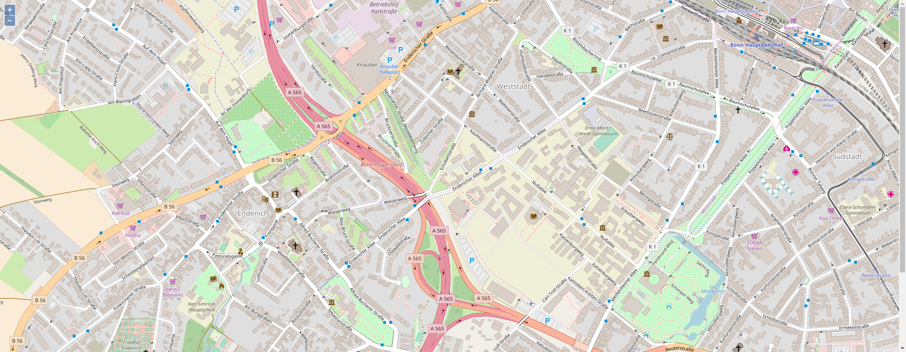

# MapComponent

Wrapper for an OpenLayers map. The `ol.map` is passed to the `MapComponent` as a prop.

[](../screenshots/map_component.png)

* The map object can be shared across the whole application without passing it as prop to the whole render tree.
* The map can be created asynchronusly (using a [Promise](https://developer.mozilla.org/de/docs/Web/JavaScript/Reference/Global_Objects/Promise)) so that every child of the MapProvider is just rendered when the map is ready.

* [Code](https://github.com/terrestris/react-geo/blob/master/src/Map/MapComponent/MapComponent.jsx)

**Task:** Add a map to your application. Use openstreetmap as tile layer.

```javascript
import React, { Component } from 'react';

import './App.css';
import 'ol/ol.css';
import 'antd/dist/antd.css';
import './react-geo.css';

import OlMap from 'ol/Map';
import OlView from 'ol/View';
import OlLayerTile from 'ol/layer/Tile';
import OlSourceOsm from 'ol/source/OSM';

import {
  MapComponent
} from '@terrestris/react-geo';

const layer = new OlLayerTile({
  source: new OlSourceOsm()
});

const center = [ 788453.4890155146, 6573085.729161344 ];

// create a new instance of ol.map in ES6 syntax
const map = new OlMap({
  view: new OlView({
    center: center,
    zoom: 16,
  }),
  layers: [layer]
});

map.on('postcompose', map.updateSize);

class App extends Component {
  render() {
    return (
      <div className="App">
        <MapComponent
          map={map}
        />
      </div>
    );
  }
}

export default App;

```

Beside the OpenLayers style the app needs its own stylesheet, e.g. to size the map.
```css
html, body, #root, .App, #map {
  margin: 0;
  padding: 0;
  height: 100%;
  width: 100%;
}
```
