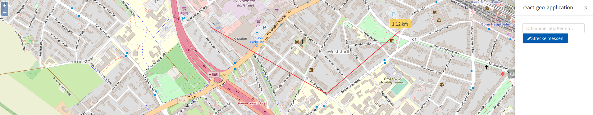

# MeasureButton

* Button (toggle) to en/disable certain `ol.interaction`s and `ol.layer`s to measure a distance, a polygonal area or angles

* [Documentation](https://terrestris.github.io/react-geo/docs/latest/index.html#!/MeasureButton)

[](../screenshots/measure_button.png)

**Task:** Add a MeasureButton to the drawer.

```javascript
import React, { Component } from 'react';

import './App.css';
import 'ol/ol.css';
import 'antd/dist/antd.css';
import './react-geo.css';

import OlMap from 'ol/Map';
import OlView from 'ol/View';
import OlLayerTile from 'ol/layer/Tile';
import OlSourceOsm from 'ol/source/OSM';

import { Drawer } from 'antd';
import {
  SimpleButton,
  MapComponent,
  NominatimSearch,
  MeasureButton
} from '@terrestris/react-geo';

const layer = new OlLayerTile({
  source: new OlSourceOsm()
});

const center = [ 788453.4890155146, 6573085.729161344 ];

const map = new OlMap({
  view: new OlView({
    center: center,
    zoom: 16,
  }),
  layers: [layer]
});

map.on('postcompose', map.updateSize);

class App extends Component {
  state = {visible: false};

  toggleDrawer = () => {
    this.setState({visible: !this.state.visible});
  }

  render() {
    return (
      <div className="App">
        <MapComponent
          map={map}
        />
        <SimpleButton
          style={{position: 'fixed', top: '30px', right: '30px'}}
          onClick={this.toggleDrawer}
          icon="bars"
        />
        <Drawer
          title="react-geo-application"
          placement="right"
          onClose={this.toggleDrawer}
          visible={this.state.visible}
          mask={false}
        >
          <NominatimSearch
            key="search"
            map={map}
          />
          <MeasureButton
            key="measureButton"
            name="line"
            map={map}
            measureType="line"
            icon="pencil"
          >
            Strecke messen
          </MeasureButton>
        </Drawer>
      </div>
    );
  }
}

export default App;
```
